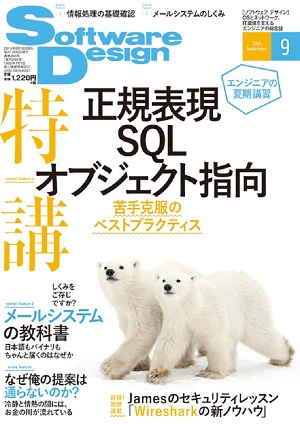

## 自己紹介

{:style="float:right;width:200px;border:0px"}

* とみたまさひろ
* 長野在住プログラマー
* https://twitter.com/tmtms
* https://tmtms.hatenablog.com
* Ruby
* MySQL
* 文字化け

---

文字化けな話ばっかりしてるような気がしますが
実はメールもやってます

---

Postfix辞典 (2006)


---

Software Design



---

今回はメールの話

---

# メールの文字化け

NSEG #101

2018/06/30

とみたまさひろ

---

その昔メールは7bitデータだった

---

ASCII文字しか送れなかった

---

ISO-2022-JPは7bit

ISO-2022-JPで日本語を使えた

---

今でもメールでISO-2022-JPが
使われてるのはその名残り

(もう世の中Unicodeなのに…)

---

でも日本語が書けるのは本文だけ

メールのヘッダにはISO-2022-JPは書けない

Subjectには書けるけど、From や To には書けない

---

```text
From: "display name" <local@domain.name>
```

「`"`」で括ればだいたいのASCII文字は書けるんだけど
ISO-2022-JPは「`"`」を含んでる
「`@`」「`<`」「`>`」も含んでる

`柊明治` : `^[$BI"L@<#^[(B`

---

メールヘッダに日本語を書けなかったから
メール本文の冒頭で名乗る文化が
生まれたんじゃないかなぁ
(個人の感想です)

---

### MIMEの登場

Multipurpose Internet Mail Extensions

RFC 2045-2049

---

### MIME

* ヘッダ部で非ASCII文字

* 添付ファイル(マルチパート)

---

## Charsetの問題

---

Content-Type で文字コードを指定

```text
Content-Type: text/plain; charset=ISO-2022-JP
```

---

Charset指定と本文のエンコーディングが異なる

```text
Content-Type: text/plain; charset=ISO-2022-JP

なぜか本文はSHIFT_JIS
```

**文字化け！**{:class="fragment"}

---

Charset指定が無い

```text
Content-Type: text/plain

ASCIIのはずだけど日本語
```

**文字化け！**{:class="fragment"}

---

Subjectが生ISO-2022-JP

```
Subject: ^[$B%"%a%s%\@V$$$J$"$$$&$($*^[(B
```

MIME以前

---

### Charsetが嘘

本来ISO-2022-JPは次の文字を含まない

* 半角カナ: ｱ ｲ ｳ
* 丸囲み数字: ① ② ③
* ローマ数字: Ⅰ Ⅱ Ⅲ
* 組文字: ㈱ ㌫

---

ISO-2022-JPと名乗っているけど
みんなが使ってるのは別のエンコーディング

ISO-2022-JPを信じると…

**文字化け！**{:class="fragment"}

---

Charset変換

| メール上のcharset | 実際のエンコーディング |
|-------------------|------------------------|
| ISO-2022-JP       | CP50221                |
| SHIFT_JIS         | CP932 (Windows-31J)    |
| EUC-JP            | CP50932                |
| GB2312            | GBK                    |

---

## MIMEヘッダエンコーディングは複雑すぎてつらい

---

### encoded-word

非ASCII文字をエンコード

`=?charset?B?Base64化文字列?=`

`=?charset?Q?abc=E3=81=82?=`

---

「`MIMEヘッダエンコーディングは複雑すぎてつらい`」

↓

```text
Subject: =?utf-8?b?TUlNReODmOODg+ODgOOCqOODs+OCs+ODvOODh+OCo+ODs+OCsOOBr+ikh+mbkeOBmeOBjuOBpuOBpOOCieOBhA==?=
```

---

長い

encoded-wordは75バイト以下 (RFC5322)

---

空白があれば折り返せるけど空白がない

---

むりやり折り返しちゃだめ

```text
Subject: =?utf-8?b?TUlNReODmOODg+ODgOOCqOODs+OCs+ODvOODh+OCo+ODs+
 OCsOOBr+ikh+mbkeOBmeOBjuOBpuOBpOOCieOBhA==?=
```

**文字化け！**{:class="fragment"}

---

複数のencoded-wordとして分割

```text
Subject: =?utf-8?b?TUlNReODmOODg+ODgOOCqOODs+OCs+ODvOODh+OCo+OD?=
 =?utf-8?b?s+OCsOOBr+ikh+mbkeOBmeOBjuOBpuOBpOOCieOBhA==?=
```

でもこれでも

**文字化け！**{:class="fragment"}

---

文字を分割しちゃだめ (RFC2047)

```text
=?utf-8?b?TUlNReODmOODg+ODgOOCqOODs+OCs+ODvOODh+OCo+OD?=
```
↓
`MIMEヘッダエンコーディ` + E3 83

```text
=?utf-8?b?s+OCsOOBr+ikh+mbkeOBmeOBjuOBpuOBpOOCieOBhA==?=
```
↓
B3 + `グは複雑すぎてつらい`

---

正しい

```text
Subject: =?utf-8?b?TUlNReODmOODg+ODgOOCqOODs+OCs+ODvOODh+OCow==?=
 =?utf-8?b?44Oz44Kw44Gv6KSH6ZuR44GZ44GO44Gm44Gk44KJ44GE?=
```

---

ASCIIと日本語混在

```text
MIME =?utf-8?b?44OY44OD44OA44Ko44Oz44Kz44O844OH44Kj44Oz44Kw?=
```
↓
`MIME ヘッダエンコーディング`

空白が入る

隣り合ったencoded-wordの間の空白は詰められる

---

くっつけちゃダメ

```text
MIME=?utf-8?b?44OY44OD44OA44Ko44Oz44Kz44O844OH44Kj44Oz44Kw?=
```

繋がってる場合はASCIIも含めてエンコーディング

---

`"` で括ってもダメ

```text
"MIME =?utf-8?b?44OY44OD44OA44Ko44Oz44Kz44O844OH44Kj44Oz44Kw?="
```

`"` で括られた文字列はencoded-wordではない (RFC2047)

---

ISO-2022-JPはさらに複雑

---

ISO-2022-JPはエスケープシーケンスで
複数の文字集合を切り替え

| エスケープシーケンス | 文字集合 |
|----------------------|----------|
| ESC ( B              | ASCII    |
| ESC ( J              | JIS X 0201 ラテン文字 |
| ESC $ @              | JIS X 0208-1978 |
| ESC $ B              | JIS X 0208-1983 |

---

encoded-wordはASCIIで始まり
ASCIIで終わらないとダメ (RFC2047)

ASCIIに戻すには 1B 28 42 の3バイト必要

75バイトに納める処理が複雑

ちゃんとやらないと

**文字化け！**{:class="fragment"}

---

## 添付ファイル名

---

MIME後も添付ファイル名に非ASCIIは使えなかった

---

MIMEのファイル名

```text
Content-Type: application/octet-stream;
  name=filename.ext
```

---

`name=` の値には `=`, `?` が使えない (RFC2045)

つまりencoded-wordが使えない

---

`"` で括れば `=`, `?` も使えるんだけど

`"` で括るとencoded-wordとみなされない (RFC2047)

---

…はずなんだけど、結構そういう実装ある

```text
Content-Type: application/octet-stream;
  name="=?UTF-8?B?44G744GSLnhscw==?="
```

文字化けしない

ホントはダメ

---

RFC2231 で可能に

```text
Content-Type: application/octet-stream;
  name*=utf-8''%E3%81%BB%E3%81%92.xls
```

MIMEヘッダエンコーディングとはまた別の方式

---

古い規格に矛盾しないように拡張を重ねてきた

---

だけど…

---

## Internationalized Email

| RFC6530 | Overview and Framework for Internationalized Email
| RFC6531 | SMTP Extension for Internationalized Email
| RFC6532 | Internationalized Email Headers
| RFC6533 | Internationalized Delivery Status and Disposition Notifications

---

メールアドレスとかメールヘッダにUTF-8文字が
そのまま使える

---

# 文字化けさよなら

---

RFCは2012年発行

どれくらい普及してるんだろう

一度ちゃんとRFC読んでみないとなー

---

おわり

